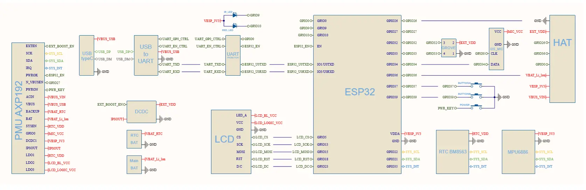

# Note


## Device Specification

```
Resources	Parameter
ESP32	240MHz dual core, 600 DMIPS, 520KB SRAM, Wi-Fi, dual mode Bluetooth
Flash Memory	4MB
Power Input	5V @ 500mA
Port	TypeC x 1, GROVE(I2C+I/0+UART) x 1
LCD screen	0.96 inch, 80*160 Colorful TFT LCD, ST7735S
Button	Custom button x 2
LED	RED LED
MEMS	MPU6886
IR	Infrared transmission
MIC	SPM1423
RTC	BM8563
PMU	AXP192
Battery	95 mAh @ 3.7V
Antenna	2.4G 3D Antenna
PIN port	G0, G26, G36
Operating Temperature	32°F to 104°F ( 0°C to 40°C )
Net weight	15.1g
Gross weight	33g
Product Size	48.2*25.5*13.7mm
Package Size	55*55*20mm
Case Material	Plastic ( PC )
```

## Schematic




## PinMap

